# 电梯调度算法

## 整体设计思路

1. 使用pyqt，设计GUI界面，继承QWidget类

2. 单个电梯：Elev继承Thread类，每个电梯自己拥有一个线程
   - 单个电梯线程思路：from threading import Thread
     - 重写run方法：run方法相当于线程的主函数
     - 通过Elev的属性：包括当前楼层、目标楼层、移动状态、目标状态、门运行状体控制电梯运行
     - 通过按钮控件connect的函数，修改Elev的属性，例如：按下内部5楼按钮，在in_goal列表中加入5层，将状态设置为向上
   
3. 共享信息：全局变量，包括外部按钮，外部请求，楼层高度，电梯数量等

## 具体展示

- 内部上下楼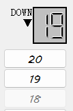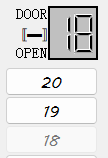

- 同层开门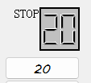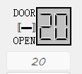

- 外部下楼——连按三层

  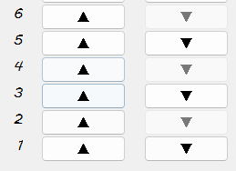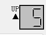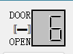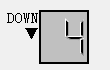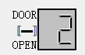

- 外部上楼——连按三层（部分过程截图）

  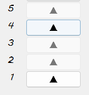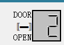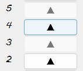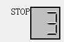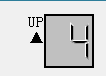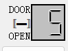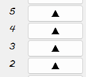

- 外部上下同时按多层——调度两台电梯，调度多台电梯

  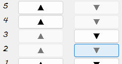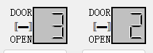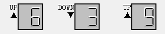


## UI设计

使用：pyqt5

### 类：继承QWidget

```python
class GUI(QWidget):
    def __init__(self):
        super().__init__()
        self.initUI()
```

初始化：main函数中

```python
app = QApplication(sys.argv)
w = GUI()
sys.exit(app.exec_())
```


### 布局：使用网格布局

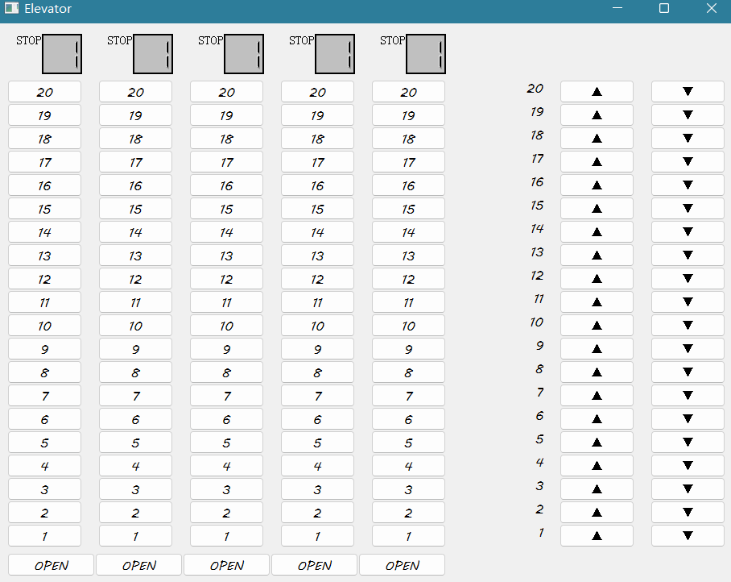

```python
screens = QGridLayout()  # 楼层显示
inButtons = QGridLayout()  # 内部按钮
openButtons = QGridLayout()  # 开门按钮
outButtons = QGridLayout()  # 外部按钮
grid = QGridLayout()  # 显示和按钮在一个表格布局中

# 间距设置
screens.setHorizontalSpacing(20)  # 设置楼层显示之间的间距
inButtons.setHorizontalSpacing(20)  # 设置电梯内按钮列之间的间距
outButtons.setHorizontalSpacing(20)  # 设置电梯外按钮列之间的间距
grid.setHorizontalSpacing(100)  # 设置内外按钮列之间的间距
```

1. 显示板为一个栅格
2. 内部按钮为一个栅格，嵌套五个电梯分别的按钮栅格
3. 外部按钮为一个栅格，嵌套向上和向下按钮
4. 开门按钮为一个栅格

控件加入布局的方法：addWidget

```python
inButtons.addWidget(button, height - floor + 1, elev)  # 加到栅格布局里
```

#### 小栅格嵌套入整体栅格

```python
# 整体是一个栅格布局，分别加入进去
grid.addLayout(inButtons, 1, 0)  # 内部按钮加入整体布局
grid.addLayout(openButtons, 2, 0)  # 开门按钮加入整体布局
grid.addLayout(outButtons, 1, 1)  # 外部按钮加入整体布局
grid.addLayout(screens, 0, 0)  # 显示楼层加入整体布局
self.setLayout(grid)
```

### 按钮控件

#### 方法

1. 创建按钮

   ```python
   open_but = QPushButton("OPEN")
   ```

2. 重要！按钮响应

   1. 开门按钮响应elve类的方法open_fun
   
      ```python
      open_but.clicked.connect(elevs[elev].open_fun)
      ```

   2. 楼层内部按钮响应elev方法

      ```python
      button.clicked.connect(partial(elevs[elev].set_goal, floor))
      ```

   3. 楼层外部按钮响应函数

      ```python
      button.clicked.connect(partial(out_request, STATE.DOWN, floor))
      ```
   

#### 外部按钮

```python
for floor in floors:
	# 外部按钮：20层楼-20行，上下-2列---------------------------
	text = QLabel(str(floor))  # 按钮的楼层
	text.setFont(QFont("MV BoLi"))  # 字体
	text.setAlignment(QtCore.Qt.AlignRight)
	outButtons.addWidget(text, height - floor + 1, 0)
```

#### ★关于按钮按下与恢复

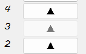

```python
self.in_button[goal].setEnabled(False)  # 按下去了，变灰
```

#### 重要问题解决：如何解决电梯到达楼层后按钮恢复问题

- 思路：将按钮封装入电梯类，在电梯类内进行操作

- ```python
  def run(self):  # 电梯自身上下运行，相关参数为state，goal
      while True:  # 移动一层、开门一次循环
          if self.DOOR_RUN:  # 如果需要开门
              self.label.setText("DOOR\n▬\nOPEN")
              time.sleep(self.door_time)
              self.DOOR_RUN = False  # 门关了
              self.in_button[self.floor].setEnabled(True)  # 按钮恢复
  ```

  例如，在线程主函数中，若到达某楼层并开门，则内部按钮恢复可以按的状态self.in_button[self.floor].setEnabled(True)  

  ```python
  # 开门时的外部按钮恢复逻辑
  if self.req_state != STATE.STOP:
      request[self.req_state][self.floor] = False
      out_button[self.req_state][self.floor].setEnabled(True)  # 同时外部按钮恢复
  ```

  而外部按钮，需要其他的属性req_state记录请求状态

## Elev类

- 状态枚举

  ```python
  class STATE(Enum):
      STOP = 0  # 完全停止，没有任务
      UP = 1  # 向上运行，包括暂停在某一层开门
      DOWN = 2
  ```

### 属性

```python
move_state = STATE.STOP
req_state = STATE.STOP
runLock = threading.Lock()  # 当STOP时，用来锁住线程
DOOR_RUN = False  # 暂停, 不论向上，向下，停止，pause都表示开关门
floor = 1
door_time = 1.5
move_time = 1
in_button = {}  # elev_button{floor}  # floor序号 1——max
lcd = None
label = None
```

其中重要的属性有

- move_state记录当前电梯的移动属性：向上，向下，停止

- DOOR_RUN记录是否需要开门

- req_state记录外部请求的方向属性

  - **为什么还需要多着一个属性？和move_state的区别是？**

    顾名思义，move_state用于移动，每一次线程主循环的函数中，如果move_state为up则楼层需要+1，down需要-1，stop则不动

    而req_state，例如，move_state为up，但是2和4楼都有向下的下楼请求，此时电梯不能响应路过的上楼请求，同时必须先去4楼，所以req_state在整个过程中起到标记作用

### 线程主函数run函数

- **开门DOOR_RUN状态**：不论电梯向上、向下、完全停止，都有可能开门

  1. 内部按钮的恢复
  1. 外部按钮的恢复
  1. 关门后电梯状态属性的变更
  
  ```python
  if self.DOOR_RUN:  # 如果需要开门
      self.label.setText("DOOR\n▬\nOPEN")
      time.sleep(self.door_time)
      self.DOOR_RUN = False  # 门关了
      self.in_button[self.floor].setEnabled(True)  # 按钮恢复
  
      # 开门时的外部按钮恢复逻辑
      if self.req_state != STATE.STOP:
          request[self.req_state][self.floor] = False  # 从等待中删除
          out_button[self.req_state][self.floor].setEnabled(True)  # 同时外部按钮恢复
  
          # 门改变后更改状态（因为按钮等部分需要用到状态
          if len(self.out_req[STATE.UP]) == len(self.out_req[STATE.DOWN]) == 0:
              self.req_state = STATE.STOP
              if len(self.in_goal) == 0:
                  self.move_state = STATE.STOP
                  self.label.setText("STOP")
  ```
  
- **运行状态（门没有运行）**

  对运行状态move_state的处理

  ```python
  if self.floor in self.in_goal:  # 到达开门层
      self.in_goal.remove(self.floor)  # 到达该层，从目标中删除
      self.DOOR_RUN = True  # 设置为开门态
  elif self.move_state == STATE.UP:  # 向上移动一层
      self.label.setText("UP\n▲")
      time.sleep(self.move_time)
      self.floor = self.floor + 1
  elif self.move_state == STATE.DOWN:  # 向下移动一层
      self.label.setText("DOWN\n▼")
      time.sleep(self.move_time)
      self.floor = self.floor - 1
  ```

  对外部请求的处理:
  
  - 在当前运行方向的同向请求
  - 当前运行方向向下，但向上有请求，并且到达最低的一层
  - 当前运行方向向上，但向下有请求，并且到达最高的一层
  
  ```python
  # 外部处理
  if self.move_state != STATE.STOP and self.floor in self.out_req[self.move_state]:  # 当前运行方向的同向请求
      self.out_req[self.move_state].remove(self.floor)  # 移除该方向该请求-----------------req_state恢复？
      self.DOOR_RUN = True  # 设置为开门态
  elif self.move_state == STATE.DOWN and self.req_state == STATE.UP and self.floor == \
      self.out_req[self.req_state][0]:
      # 当前运行方向向下，但向上有请求，并且到达最低的一层
      self.out_req[self.req_state].remove(self.floor)  # 移除该请求
      self.DOOR_RUN = True  # 设置为开门态-------------------?state怎么办
      self.move_state = self.req_state
      # out_button[self.req_state][self.floor].setEnabled(True)  # 同时外部按钮恢复
  elif self.move_state == STATE.UP and self.req_state == STATE.DOWN and self.floor == \
  	self.out_req[self.req_state][-1]:
      # 当前运行方向向上，但向下有请求，并且到达最高的一层
      self.out_req[self.req_state].remove(self.floor)  # 移除该请求
      self.DOOR_RUN = True  # 设置为开门态-------------------?state怎么办
      self.move_state = self.req_state
      # out_button[self.req_state][self.floor].setEnabled(True)  # 同时外部按钮恢复
  ```
  

###  内部按钮响应函数

```python
def set_goal(self, goal):
    if (self.move_state == STATE.STOP or
        self.move_state == STATE.UP and goal >= self.floor and goal not in self.in_goal or
        self.move_state == STATE.DOWN and goal <= self.floor and goal not in self.in_goal):

        self.in_button[goal].setEnabled(False)  # 按下去了，变灰

        if goal != self.floor:  # 按下的不是当前层
            bisect.insort(self.in_goal, goal)  # 有序插入目标数组

            self.state_startToMove(goal)  # 从停止到运行
        else:  # 按下的是当前层
            self.DOOR_RUN = True  # 在当前层则开关门
        return True
    else:
        return False
```

### 外部按钮响应函数

需要着重处理的情况：eg.外部同时按下2,3,5层的向下请求——电梯需要先到达5层，再向下运行

```python
def set_out(self, goal, req_dir):
    if (self.move_state == STATE.STOP or
        self.move_state == STATE.UP and goal >= self.floor and goal not in self.out_req[req_dir] or
        self.move_state == STATE.DOWN and goal <= self.floor and goal not in self.out_req[req_dir]):

        if goal != self.floor:  # 按下的不是当前层
            if self.req_state == STATE.STOP or self.req_state == req_dir:
                bisect.insort(self.out_req[req_dir], goal)  # 有序插入该方向上的请求
                self.req_state = req_dir
            else:
                return False

            self.state_startToMove(goal)  # 从停止到运行
        else:  # 按下的是当前层
            self.DOOR_RUN = True  # 在当前层则开关门
        return True
    else:
        return False
```

